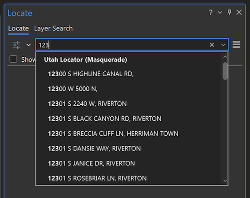

# Masquerade

A proxy service that impersonates an Esri locator using UGRC data and web services. Use the following URL in Esri products anywhere you would use a [geocode service](https://www.esri.com/en-us/arcgis/products/arcgis-platform/services/geocoding-search).

> [https://masquerade.ugrc.utah.gov/arcgis/rest/services/UtahLocator/GeocodeServer](https://masquerade.ugrc.utah.gov/arcgis/rest/services/UtahLocator/GeocodeServer)

## Capabilities

- Single line address geocoding (convert an address to an x,y coordinate). Powered by the [UGRC web API](https://api.mapserv.utah.gov/#geocoding).
- Provides typeahead suggestions from the following datasets in [Open SGID](https://gis.utah.gov/sgid/open-sgid/) and returns the centroid:

| Name                                                                                                                    | Dataset                                         | Search Field |
|-------------------------------------------------------------------------------------------------------------------------|-------------------------------------------------|-----|
| [Utah House Districts 2022 to 2032](https://opendata.gis.utah.gov/maps/utah-house-districts-2022-to-2032)               | `political.house_districts_2022_to_2032`        | `dist` |
| [Utah School Board Districts 2022 to 2032](https://opendata.gis.utah.gov/maps/utah-school-board-districts-2022-to-2032) | `political.school_board_districts_2022_to_2032` | `dist` |
| [Utah Senate Districts 2022 to 2032](https://opendata.gis.utah.gov/maps/utah-senate-districts-2022-to-2032)             | `political.senate_districts_2022_to_2032`       | `dist` |
| [Utah US Congress Districts 2022 to 2032](https://opendata.gis.utah.gov/maps/utah-us-congress-districts-2022-to-2032)   | `political.us_congress_districts_2022_to_2032`  | `district` |
| [Utah Address Points](https://opendata.gis.utah.gov/datasets/utah-address-points)                                       | `location.address_points`                       | `name` |
| [Utah County Boundaries](https://opendata.gis.utah.gov/datasets/utah-county-boundaries)                                 | `boundaries.county_boundaries`                  | `name` |
| [Utah Municipal Boundaries](https://opendata.gis.utah.gov/maps/utah-municipal-boundaries)                               | `boundaries.municipal_boundaries`               | `name` |
| [Utah ZIP Code Areas](https://opendata.gis.utah.gov/maps/utah-zip-code-areas)                                           | `boundaries.zip_code_areas`                     | `zip5` |
| [Utah GNIS Place Names](https://opendata.gis.utah.gov/maps/utah-gnis-place-names)                                       | `location.gnis_place_names`                     | `name` |

_Give Masquerade's awesome searching capabilities a try in this [simple web app](https://arcg.is/0na9Lf0)._

### Supported Esri Geocode Service Operations

✅ Find Address Candidates

✅ Geocode Addresses

✅ Suggest

Reverse Geocode has not been implemented. [Let us know](https://github.com/agrc/masquerade/issues/new) if you are interested in this feature!

[Esri REST API Reference](https://developers.arcgis.com/rest/services-reference/enterprise/geocode-service.htm)

## Common Use Cases

### ArcGIS Pro

If you are looking for a way to quickly navigate your map to Utah addresses or points of interest within ArcGIS Pro, Masquerade can help. By adding [UGRC's "Utah Locator (Masquerade)"](https://utah.maps.arcgis.com/home/item.html?id=f19e6205b9bd49e8a39ed51ddd58164a) (hosted in ArcGIS Online) [to your project](https://pro.arcgis.com/en/pro-app/latest/help/data/geocoding/add-locators-to-a-project.htm) it becomes available to use within the [Locate pane](https://pro.arcgis.com/en/pro-app/latest/help/data/geocoding/find-places-on-the-map.htm). To accomplish this, follow these steps:

1. Add the locator to your project by right-clicking in the "Locators" folder and selecting "Add Locator"
1. Browser to Portal -> ArcGIS Online and then search for "Masquerade"
1. Select "Utah Locator (Masquerade)"
1. Open any map and then go to the "Locate" pane
1. Click on the settings options drop-down button to the left of the search bar and verify that "Utah Locator (Masquerade)" is selected.
1. Start typing in the search box and type-ahead suggestions will start appearing. Click on any suggestion to zoom the map to it.
1. For geocoding single line addresses that do not show up in the type-ahead suggestions, type in the complete address with a zip or city and press enter. (e.g. `123 S Main Street, Holladay`).

You should see typeahead suggestions from all of the [Open SGID](https://gis.utah.gov/sgid/open-sgid/) tables above. Here are a few examples:

Once Masquerade has been added as a locator to your project, you can also use it as an input address locator with the [Geocode Addresses geoprocessing tool](https://pro.arcgis.com/en/pro-app/latest/tool-reference/geocoding/geocode-addresses.htm) for batch geocoding of address data. This makes Masquerade a much easier alternative to the our old [Geocoding Toolbox](https://github.com/agrc/geocoding-toolbox).

### Web AppBuilder/Experience Builder

Masquerade can be used to power the search widget in [Web AppBuilder](https://doc.arcgis.com/en/web-appbuilder/latest/create-apps/widget-search.htm) or [Experience Builder](https://developers.arcgis.com/experience-builder/guide/search-widget/). To configure, use the following URL as the "Geocoder URL" (WAB) or "Locator URL" (EB) value in the search widget settings:

> [https://masquerade.ugrc.utah.gov/arcgis/rest/services/UtahLocator/GeocodeServer](https://masquerade.ugrc.utah.gov/arcgis/rest/services/UtahLocator/GeocodeServer)

## Alternatives

### UGRC API Client Desktop Application

If you are not already using Esri products, you likely want to check out the [Official UGRC API Client](https://gis.utah.gov/introducing-the-official-ugrc-api-client/). This is a streamlined, stand-alone desktop application that requires no Esri products or licenses.

## Development

### URLs

| Environment | URL                                                            |
|-------------|----------------------------------------------------------------|
| Production  | [https://masquerade.ugrc.utah.gov/arcgis/rest/services/UtahLocator/GeocodeServer](https://masquerade.ugrc.utah.gov/arcgis/rest/services/UtahLocator/GeocodeServer) |
| Staging     | [https://masquerade-gcedbtv4sa-uc.a.run.app/arcgis/rest/services/UtahLocator/GeocodeServer](https://masquerade-gcedbtv4sa-uc.a.run.app/arcgis/rest/services/UtahLocator/GeocodeServer) |
| Local       | [https://localhost:5000/arcgis/rest/services/UtahLocator/GeocodeServer](https://localhost:5000/arcgis/rest/services/UtahLocator/GeocodeServer) |

### One-time Setup

1. create new python environment: `python -m venv venv`
1. activate new environment: `source venv/bin/activate` (On Windows: `.env\Scripts\activate`)
1. install dependencies and editable project: `pip install -e ".[tests]"`
1. create `.env` (using `.env.sample` as a template) and populate this `WEB_API_KEY` variable with a newly created api key. Use type: `browser` and referer: `masquerade.agrc.utah.gov`.

#### MacOS

1. install [mkcert](https://github.com/FiloSottile/mkcert) `brew install mkcert`
1. create locally-trusted cert (from root): `mkcert -key-file key.pem -cert-file cert.pem localhost 127.0.0.1 10.211.55.2`
   - `10.211.55.2` is the default ip for the Parallels host machine
1. install the mkcert CA on your local machine
   - `mkcert -install`
1. install the mkcert CA on another VM
   - copy `rootCA.pem` and `rootCA-key.pem` from the directory that is the output of `mkcert -CAROOT`
   - paste these files into a file on the VM
   - install mkcert on the VM
   - run `set CAROOT=<pasted directory> && mkcert -install` on the VM (windows terminal works better than a console emulator)

#### Windows

1. install [mkcert](https://github.com/FiloSottile/mkcert) `choco install mkcert`
1. run `mkcert -install`
1. create locally-trusted cert (from root): `mkcert -key-file key.pem -cert-file cert.pem localhost 127.0.0.1`

#### CI/CD

1. Run [the terraform code associated with this project](https://github.com/agrc/gcp-terraform/tree/main/masquerade).
1. Create `dev` and `prod` environments in GitHub repo.
1. Create repo-wide secrets:
   - `WEB_API_KEY`
   - `CODECOV_TOKEN`

1. create secrets in github for each environment

   - `PROJECT_ID`
   - Secrets contained in `github-actions-secrets-[prod/dev].txt` (output from terraform)

### Tests

(**P**ython **T**est **W**atch will restart the tests every time you save a file)

`ptw`

### Development Server

`./run.sh` (macOS) or `run.bat` (Windows)

[Here is a web app builder project](https://utah.maps.arcgis.com/apps/webappviewer/index.html?id=97a1529c31c84a93956968d48c6e08ad) that is pointed at `https://localhost:5000/` that can be used for testing.

### Deployment to GCP

When changes are pushed to either the `main` (production) or `staging` branches, the project is automatically built and deployed to the appropriate GCP project (pending passing tests).

### Analytics

[Data Studio](https://datastudio.google.com/s/pUR8vYLVHvs)
